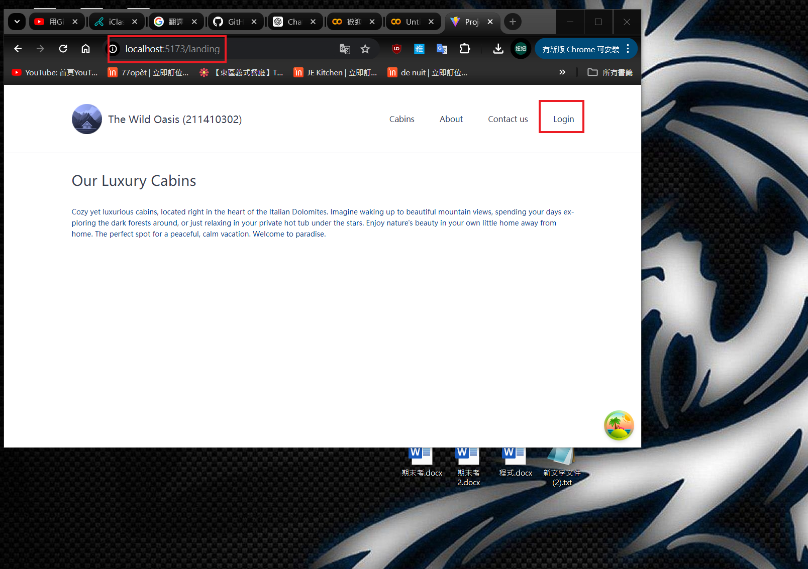
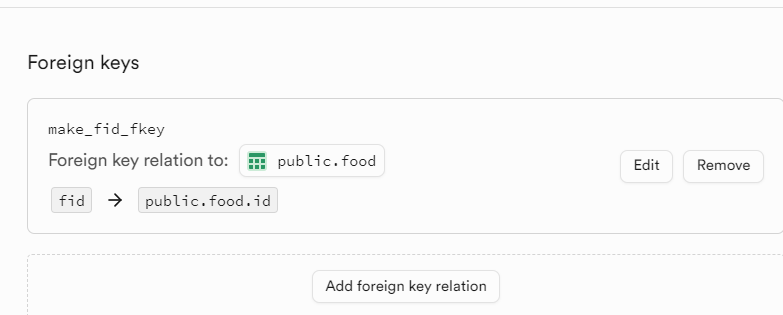
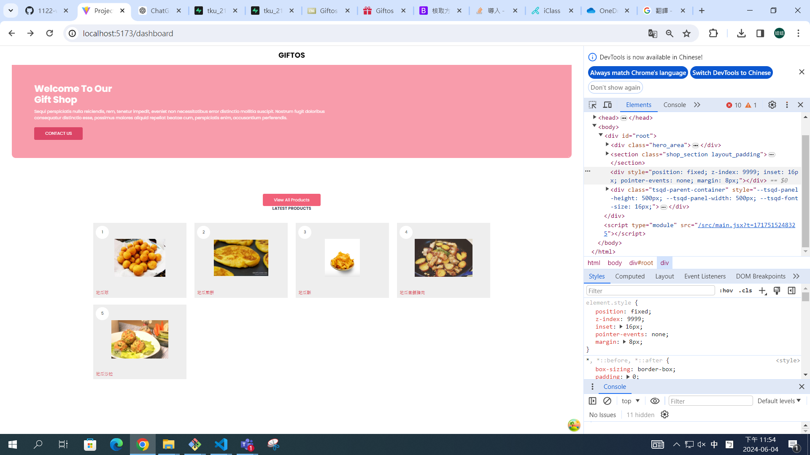
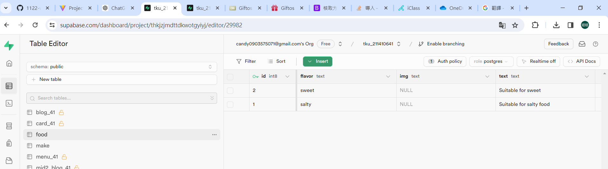

[Final Project -- Github URL](https://github.com/100peggy/1122-wp2-2N_41/tree/main/demo)

[Final Project -- Vercel URL]()

## 評分說明

1. 基本分：(30%~70%)
   依老師上課架構及內容，改換成其他應用，基本上可以執行者
2. 進階分 (30%)
   依前台及後台完成度評分，自己努力愈多，完成度愈高者，分數愈高。

## Project 說明

### 重點 1 -- 單人，還是兩人，如何分工

單人

### 重點 2 -- Project 簡要介紹

地瓜料理介紹
含有甜鹹分類 食材

#### => project requirements

路由 主頁 登入 登出

#### => featured category, pages with routes

之後預計做點選可以查看此食物細節(已完成)

### 重點 3 -- Supabase 後台 schemas and data 支援

### 重點 4 -- React 前台， code 模組設計

還在規劃

### 重點 5 -- 整體完成度

## 資料及網路資源來源說明

### 網路資源來源 1

參考資料來源
https://www.free-css.com/free-css-templates/page293/giftos

### 網路資源來源 2

### 網路資源來源 3

---

## 後端 Supabase 資料庫設計

### SQL schema and data

#### => table 1

5 食物名稱以及配方

#### => table 2

食物甜鹹分類

#### => table 3

#### => 外部鍵及 RLS 設定

#### => 提供執行一次就可重新建立 schema 及 data 之 SQL 指令

---

## 前端程式設計說明

### => 功能 1 ，畫面設計，完成度說明

點擊食物圖片,可出現食物材料 作法

### => 功能 2 及畫面設計，完成度說明

### => 功能 3 及畫面設計，完成度說明

### => 功能 4 及畫面設計，完成度說明

### => 功能 5 及畫面設計，完成度說明

---

## 解決問題說明

### => 問題 1

名稱打錯(已解決)

### => 問題 2

supabase 叫不進來(權限問題)

### => 問題 3

### => 問題 4

### => 問題 5

---

## 學習甘苦談

### => 1.

太多阻礙了 我快瘋了

### => 2.

找資料好辛苦 我好不容易找到這個

### => 3.

### => 4.

### => 5.
